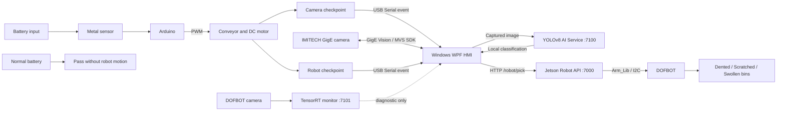

# Battery Inspection and Sorting System

Hệ thống kiểm tra và phân loại pin tự động sử dụng camera công nghiệp
IMITECH, mô hình YOLOv8, băng tải Arduino và tay robot DOFBOT chạy trên
Jetson Nano.

Repository này chứa toàn bộ **mã nguồn vận hành hiện hành**:

- ứng dụng HMI Windows viết bằng WPF/C#;
- Windows AI Service và model YOLOv8n Detection;
- Jetson Robot API, Vision Monitor và cấu hình systemd;
- TensorRT monitor-only service cho camera DOFBOT;
- script thiết lập, kiểm tra, benchmark và deploy.

## Kiến trúc hệ thống



### Luồng phân loại hiện tại

1. Cảm biến kim loại phát hiện pin; Arduino điều khiển băng tải.
2. Arduino dừng pin tại Camera checkpoint và gửi thông báo qua USB Serial.
3. WPF chụp một frame và gửi ảnh tới AI Service.
4. YOLOv8 trả về `normal`, `dented`, `scratched` hoặc `swollen`.
5. Arduino tự đưa pin tới robot checkpoint và phát thông báo dừng.
6. Với pin lỗi, WPF gửi một job `/robot/pick` tới Robot API.
7. Với `normal`, WPF không tạo robot job.
8. DOFBOT gắp pin lỗi vào hộp tương ứng và trở về HOME.

Arduino hiện giữ quyền điều khiển timing và tự tiếp tục chu trình. Camera DOFBOT chỉ dùng để quan sát/chẩn đoán,
không kích hoạt robot.

## Cấu trúc repository

```text
DoAn/
|-- README.md
|-- WpfApp3.slnx
`-- WpfApp3/
    |-- Controls/                 # WPF views và custom controls
    |-- Dialogs/
    |-- Models/
    |-- Resources/                # Light HMI styles
    |-- Services/                 # Camera, AI, Serial và Robot clients
    |-- ViewModels/
    |-- RobotApi/Jetson/
    |   |-- Backend/              # robot_api.py, vision_trigger.py, deploy
    |   `-- TensorRT/             # DOFBOT monitor-only inference
    |-- Tools/AI/Service/
    |   |-- ai_service.py
    |   |-- models/best.pt
    |   `-- MiniPC/               # CPU environment scripts
    `-- WpfApp3.csproj
```

## Yêu cầu

### Windows PC

- Windows 10/11 x64;
- [.NET 8 SDK](https://dotnet.microsoft.com/download/dotnet/8.0);
- MVS, bao gồm thư viện phát triển .NET 64-bit
  `MvCameraControl.Net.dll`;
- Python 3.11 x64 nếu chạy AI Service từ source;
- driver Arduino/USB Serial phù hợp;
- kết nối Gigabit Ethernet cho camera IMITECH.

Project mặc định tìm MVS SDK tại:

```text
C:\Program Files (x86)\MVS\Development\DotNet\win64\netstandard2.0\MvCameraControl.Net.dll
```

Nếu MVS được cài ở vị trí khác, cập nhật `HintPath` trong
`WpfApp3/WpfApp3.csproj`.

### Jetson Nano / DOFBOT

- Jetson Nano và nguồn phù hợp;
- Docker;
- container DOFBOT hiện hành: `dofbot_robot_api`;
- Python/Arm_Lib có sẵn trong container;
- Jetson và máy tính có cùng mạng tin cậy.

Địa chỉ mặc định của project:

| Thành phần | Địa chỉ |
|---|---|
|AI Service | `http://127.0.0.1:7100` |
|Robot API | `http://192.168.137.179:7000` |
|TensorRT monitor | `http://192.168.137.179:7101` |

Các địa chỉ này phải được thay đổi nếu cấu hình mạng khác.

## Cài đặt lần đầu

Clone repository:

```powershell
git clone https://github.com/nagithd/DoAn.git
Set-Location ".\DoAn\WpfApp3"
$ProjectRoot = (Get-Location).Path
```

Khôi phục WPF dependencies:

```powershell
dotnet restore
```

### Cài môi trường AI trên Windows

```powershell
Set-Location "$ProjectRoot\Tools\AI\Service\MiniPC"
Set-ExecutionPolicy -Scope Process Bypass
.\setup_minipc_yolo.ps1
```

Script tạo môi trường riêng tại:

```text
WpfApp3\Tools\AI\Service\.venv-minipc
```

Việc tải PyTorch/Ultralytics lần đầu cần Internet. `.venv-minipc` không được
commit vào repository.

## Khởi động hệ thống

### 1. Kiểm tra an toàn

- Dọn sạch vùng chuyển động của DOFBOT.
- Không để đồ vật cản trở tay robot.
- Đảm bảo băng tải trống cho tới khi vận hành.
- Giữ công tắc ngắt nguồn vật lý trong tầm với.
- Đóng Arduino Serial Monitor trước khi WPF mở COM port.
- Đóng MVS acquisition trước khi WPF mở camera.

### 2. Kiểm tra Jetson Robot API

```powershell
Set-Location "$ProjectRoot\RobotApi\Jetson"
.\check_service.ps1
```

Chỉ vận hành khi `/health` báo `status=ok`, robot được khởi tạo và worker còn
hoạt động. Kiểm tra trực tiếp:

```powershell
Invoke-RestMethod "http://192.168.137.179:7000/health"
Invoke-RestMethod "http://192.168.137.179:7000/robot/status"
```

### 3. Khởi động Windows AI Service

Mở PowerShell riêng và giữ cửa sổ này chạy:

```powershell
Set-Location "$ProjectRoot\Tools\AI\Service\MiniPC"
.\Start-MiniPC-AI-Service.ps1 -ImageSize 512 -CpuThreads 2
```

Kiểm tra AI:

```powershell
Invoke-RestMethod "http://127.0.0.1:7100/health"
```

### 4. Build và mở WPF

Mở PowerShell thứ hai:

```powershell
Set-Location $ProjectRoot
dotnet build -c Release
.\bin\Release\net8.0-windows\WpfApp3.exe
```

Hoặc:

```powershell
dotnet run -c Release
```

### 5. Bắt đầu vận hành

1. Chọn đúng IMITECH camera và Arduino COM port.
2. Nhấn `START` trên thanh hệ thống.
3. Xác nhận AI Service online, camera có live feed, Arduino đã kết nối và
   DOFBOT ở HOME.
4. Kiểm tra băng tải ở tốc độ thấp.
5. Chỉ đưa **một pin** vào trong lần kiểm tra đầu tiên.
6. Theo dõi System Log và vị trí thực của robot trong suốt chu trình.

## Deploy Robot API

Backend hiện hành nằm trong `WpfApp3/RobotApi/Jetson/Backend`. Không sử dụng
một bản `robot_api.py` khác cùng lúc.

Deploy source mới:

```powershell
Set-Location "$ProjectRoot\RobotApi\Jetson\Backend"
.\deploy.ps1
```

Deploy không tự restart service. Sau đó chạy:

```powershell
Set-Location ".."
.\restart_service.ps1
.\check_service.ps1
```

Cài systemd lần đầu:

```powershell
.\install_service.ps1
```

Không chạy Yahboom GUI, `YahboomArm.pyc`, ROS2 kinematics hoặc một Robot API
thứ hai đồng thời vì chúng có thể tranh quyền I2C/servo.

## DOFBOT TensorRT monitor

TensorRT service là tùy chọn và chỉ dùng để monitor camera DOFBOT. Xem hướng
dẫn trong:

```text
WpfApp3/RobotApi/Jetson/TensorRT/README.md
```

Model ONNX portable được lưu trong repository. File `.engine` phải được build
trên đúng Jetson/TensorRT target và không nên sao chép giữa các máy khác nhau.

## Dừng hệ thống

1. Không đưa thêm pin vào băng tải.
2. Nhấn `STOP` trong WPF để gửi yêu cầu dừng băng tải và ngừng camera monitor.
3. Chờ robot hoàn thành nếu việc chờ là an toàn.
4. Đưa DOFBOT về HOME khi vùng làm việc đã sạch.
5. Đóng WPF và AI Service.
6. Nếu tắt Jetson, sử dụng:

```bash
sudo shutdown -h now
```

WPF STOP và Robot API không phải thiết bị emergency-stop đạt chuẩn an toàn.
Khi có nguy cơ va chạm hoặc chấn thương, sử dụng ngắt nguồn vật lý.

## Model AI hiện hành

- Task: YOLO object detection;
- Model: YOLOv8n Detection;
- Input mặc định: 512 px;
- Classes: `Battery`, `Dented`, `Scratched`, `Swollen`;
- Routing: defect có confidence cao nhất;
- `Battery` không có defect được xem là `normal`;
- không phát hiện Battery và không có defect thì không tạo route.

Checkpoint hiện hành:

```text
WpfApp3/Tools/AI/Service/models/best.pt
```

## Giới hạn an toàn hiện tại

- Firmware Arduino sử dụng chu trình timing cố định và nhiều đoạn `delay()`.
- Arduino tự khởi động lại băng tải sau robot checkpoint; không có phản hồi
  hoàn thành robot dạng closed-loop.
- WPF gửi robot job nhưng không chờ job hoàn thành và không gửi `robot_done@`.
- Robot API và TensorRT monitor dùng HTTP nội bộ, chưa có authentication.
- Hàng đợi robot/classification nằm trong RAM và bị xóa khi service restart.
- Chỉ nên vận hành trên mạng tin cậy và với người giám sát tại chỗ.

Trước khi chạy liên tục, cần kiểm tra timing thực tế, nguồn servo, HOME/pick/drop
poses và thử từng class ở tốc độ thấp.
