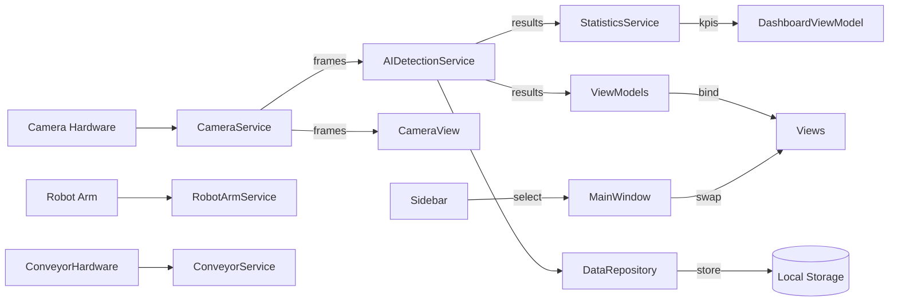
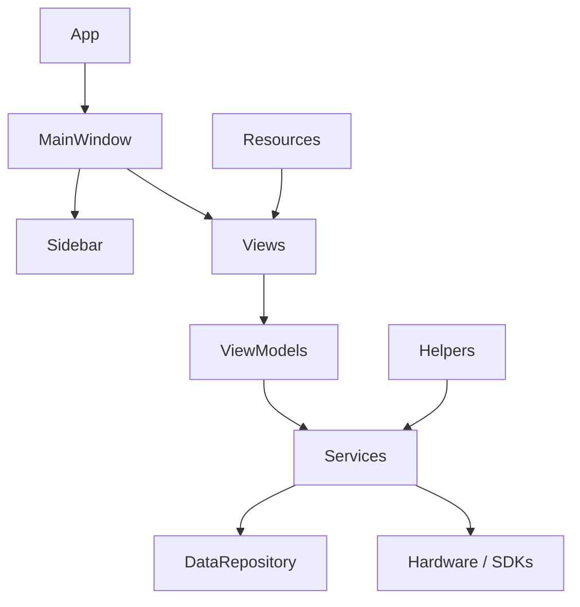

# Project Overview

- Purpose of the application

  Battery Inspection System — an industrial HMI-style desktop application that displays live camera feeds, runs AI-based detection against incoming frames, presents inspection KPIs and system status, and provides controls for conveyor and robot hardware. The UI is a WPF desktop client designed as an operator station (SCADA/HMI-like) for monitoring and controlling an inspection pipeline.

- Technologies used

  - .NET 8 (WPF)
  - CommunityToolkit.Mvvm for simple MVVM helpers (ObservableObject, ObservableProperty)
  - XAML-based UI with custom UserControls
  - Basic services pattern for device integration (Camera, Robot, Conveyor, AI)
  - Local file-based configuration and simple repository

- Design pattern

  The project follows MVVM (Model-View-ViewModel) for UI separation:
  - Views: XAML UserControls in Views/ and Controls/
  - ViewModels: ViewModels/ classes exposing observable properties & commands
  - Models: DTO/config classes in Models/
  - Services: Services/ implement device access and business logic

- Overall architecture

  - MainWindow hosts the application's shell (Top navigation, Left Sidebar, Right status, Content area).
  - Sidebar raises routed events (ItemSelected) that MainWindow consumes to swap center views (ContentControl named MainContent).
  - Views are composed of reusable Controls and bound to ViewModels. Services provide data (camera frames, detection results) and are consumed by ViewModels and/or Views.
  - Configuration and persistence helpers live in Helpers/ and Services/DataRepository.cs.

------------------------------------------------

# Folder Structure

Below is a description of each folder, its responsibilities, and interactions.

Controls/
- Purpose: Reusable UI building blocks used by Views and by MainWindow. Encapsulate visual composition and small interactions.
- Responsibility: Provide common widgets (camera preview panels, sidebar, KPI/Status cards, animations, panels used across multiple pages).
- Files inside (representative): CameraPanel.xaml(.cs), CameraPreview.xaml(.cs), CameraView.xaml(.cs), ControlPanel.xaml(.cs), ConveyorAnimation.xaml(.cs), DefectHighlight.xaml(.cs), EventLog.xaml(.cs), RobotPanel.xaml(.cs), Sidebar.xaml(.cs), StatisticsCard.xaml(.cs), StatusIndicator.xaml(.cs), SystemStatus.xaml(.cs), TopNavigationBar.xaml(.cs)
- Interacts with: Views (embedded), ViewModels (data binding), Services (for live data in some controls like CameraPreview). Sidebar is used by MainWindow for navigation.

Views/
- Purpose: Page-level UserControls composing Controls into screens that represent application areas (Dashboard, Camera screen, Conveyor, Settings, Robot arm, Statistics, Event Log).
- Responsibility: Host Controls, set DataContext (often a ViewModel), and present screen-specific layout.
- Files inside: Dashboard.xaml (redesigned), CameraView.xaml, ConveyorView.xaml, Dashboard.xaml, EventLogView.xaml, RobotArmView.xaml, SettingsView.xaml, StatisticsView.xaml, AIDetectionView.xaml
- Interacts with: ViewModels/* (DataContext), Controls/* (UI building blocks), Services indirectly through ViewModels.

ViewModels/
- Purpose: Hold presentation state, commands, and mediate between Services and Views.
- Responsibility: Expose observable properties and ICommand instances for Views to bind to. Contain nothing or minimal UI-only logic. Use Services to perform work and expose results.
- Files inside (representative): MainViewModel.cs, DashboardViewModel.cs, CameraViewModel.cs, ConveyorViewModel.cs, RobotArmViewModel.cs, SettingsViewModel.cs, AIDetectionViewModel.cs, StatisticsViewModel.cs, EventLogViewModel.cs
- Interacts with: Services/* for data access; Views via DataBinding.

Models/
- Purpose: DTOs and configuration structures used across ViewModels and Services.
- Responsibility: Carry typed data (inspection results, camera configuration, system events) across layers.
- Files inside: CameraConfiguration.cs, BatteryInspection.cs, DetectionResult.cs, InspectionStatistics.cs, ModelBase.cs, SidebarItem.cs, SystemEvent.cs, ApplicationSettings.cs
- Interacts with: Services (produce or consume models), ViewModels (display/persist models), Helpers/ConfigurationHelper for settings.

Services/
- Purpose: Application services implementing business logic and device interfacing.
- Responsibility: Provide access to devices (camera, robot, conveyor), perform AI detection, persist data, expose events/state to ViewModels.
- Files inside (representative): CameraService.cs, RobotArmService.cs, ConveyorService.cs, AIDetectionService.cs, DataRepository.cs, EventLogService.cs, SettingsService.cs, StatisticsService.cs
- Interacts with: ViewModels (consumers), Models (data shapes), Helpers (logging, configuration), hardware SDKs (not in repo but invoked from services).

Helpers/
- Purpose: Miscellaneous shared utilities.
- Responsibility: Provide configuration loading, logging helpers, extension methods, validation helpers, and a simple ServiceProvider/composition root.
- Files inside: ConfigurationHelper.cs, LoggerHelper.cs, ExtensionMethods.cs, ServiceProvider.cs, ValidationHelper.cs
- Interacts with: App startup, Services, ViewModels.

Resources/
- Purpose: Centralized XAML resources for styles, colors, typography and application theme tokens.
- Responsibility: Provide consistent styling across the app (Buttons, Typography, Colors, Resource dictionaries used by other XAML files).
- Files inside: Buttons.xaml, Cards.xaml, Colors.xaml, Converters.xaml, Styles.xaml, Theme.xaml, Typography.xaml

Models/ (already detailed above)

Doc/
- Purpose: Project documentation and design notes.
- Responsibility: Developer docs, component usage examples, architecture notes.
- Files inside: ARCHITECTURE.md, various component docs (CAMERAPANEL_DOCUMENTATION.md, SIDEBAR_DOCUMENTATION.md, etc.)

Assets/
- Purpose: Static non-code assets.
- Files: README.txt

Root files
- Purpose: Solution & project setup (WpfApp3.slnx, WpfApp3.csproj), App.xaml and App.xaml.cs (application entry), AssemblyInfo, and the PROJECT_STRUCTURE.md to be added.

------------------------------------------------

# File Responsibilities (selected important files)

File: App.xaml / App.xaml.cs

Purpose:
- WPF application entry point. Declares application resources, themes, and startup behavior.

Responsibilities:
- Register application-wide ResourceDictionaries
- Initialize any global services (if App.xaml.cs contains code)

Dependencies:
- Resources/* for theme and styles
- Helpers/ServiceProvider for composition

Called by:
- OS when launching the executable

Future modifications:
- Centralize service registration here (IoC container), add logging initialization, handle unhandled exceptions and telemetry.

---

File: MainWindow.xaml / MainWindow.xaml.cs

Purpose:
- Host shell for the application: TopNavigationBar, Left Sidebar, Center content area (MainContent), Right status panel and bottom control bar.

Responsibilities:
- Wire Sidebar.ItemSelected routed events to swap center views.
- Provide layout anchor for navigation and shared UI chrome.

Dependencies:
- Controls/Sidebar.xaml (navigation)
- Views/* pages (Dashboard, CameraView, SettingsView, etc.)

Called by:
- App.xaml on startup

Future modifications:
- Introduce NavigationService or a ViewModel-driven navigation to move logic to MVVM.

---

File: Controls/Sidebar.xaml & Sidebar.xaml.cs

Purpose:
- Left navigation control used by MainWindow for page switching.

Responsibilities:
- Render navigation items (buttons) and maintain selected state.
- Raise a routed ItemSelected event (ItemSelectedEvent) with the selected button's Tag.

Dependencies:
- Uses local styles (SidebarItemButtonStyle) defined in the same XAML and Resource dictionaries for typography/colors.

Called by:
- MainWindow listens to ItemSelected and changes MainContent accordingly.

Future modifications:
- Convert to ICommand-based selection to support MVVM binding, or expose SelectedItem dependency property.

---

File: Views/Dashboard.xaml and Views/Dashboard.xaml.cs

Purpose:
- The main operator dashboard screen. Shows live camera preview, KPI cards, AI detection summary, robot/conveyor status, system performance and recent alarms.

Responsibilities:
- Compose Controls into a responsive Grid layout.
- Manage responsive behavior (column collapse / reparenting of panels) at runtime.
- Bind to DashboardViewModel for metrics and state.

Dependencies:
- Controls/CameraView, Controls/KpiCard (new), Controls/StatisticsCard (legacy), ViewModels/DashboardViewModel.

Called by:
- MainWindow via navigation (MainContent).

Future modifications:
- Replace runtime reparenting with a NavigationService or responsive VisualStateManager, bind KPI cards to DashboardViewModel properties (TotalCount, PassRate etc.).

---

File: Controls/CameraView.xaml / CameraView.xaml.cs

Purpose:
- Encapsulate camera preview UI used on Dashboard and possibly dedicated Camera page.

Responsibilities:
- Present live video/image frames and overlay camera status (FPS, resolution, timestamp).

Dependencies:
- CameraService (for frames), AIDetectionService (if overlays are drawn from AI results).

Called by:
- Dashboard, CameraView (view) and other controls requiring preview.

Future modifications:
- Add virtualization/decoupling to avoid direct service calls from view; route through CameraViewModel.

---

File: ViewModels/DashboardViewModel.cs

Purpose:
- Provides observable KPIs and small system state used by Dashboard view.

Responsibilities:
- Expose properties: GoodCount, ScratchCount, DentCount, OtherCount, TotalCount, TodaysProduction, trends, RobotStatus, RobotTemperature, SystemHealth
- Provide place for commands (none currently present)

Dependencies:
- Ideally receives updates from StatisticsService, EventLogService or AIDetectionService (not directly wired in file).

Called by:
- Views/Dashboard.xaml (DataContext)

Future modifications:
- Add INotifyPropertyChanged-driven updates triggered from Services; add commands for interactions.

---

Files: Services/* (CameraService.cs, RobotArmService.cs, ConveyorService.cs, AIDetectionService.cs, DataRepository.cs, SettingsService.cs, EventLogService.cs, StatisticsService.cs)

Purpose:
- Encapsulate device communication, AI processing orchestration and persistence.

Responsibilities (per file):
- CameraService.cs: Discover/connect to cameras, provide frames (push or pull), expose connection state.
- AIDetectionService.cs: Run detection on frames, emit DetectionResult models, provide confidence and bounding boxes.
- RobotArmService.cs: Send commands to robot arm, poll status and temperatures.
- ConveyorService.cs: Control conveyor speed / start-stop and provide animation hooks.
- DataRepository.cs: Persist detection results, statistics, and settings to local storage.
- EventLogService.cs: Create and query system events for display in EventLog control.
- SettingsService.cs: Persist / retrieve application-level settings.
- StatisticsService.cs: Calculate aggregated KPIs (pass rate, counts) from detection events or repository data.

Dependencies:
- Helpers/ConfigurationHelper for settings, Helpers/LoggerHelper for logging, Models for data contracts.

Called by:
- ViewModels (for presentation data and actions), Controls (occasionally for direct visuals such as camera preview), other Services.

Future modifications:
- Introduce interfaces (ICameraService, IRobotArmService, IConveyorService) and register implementations in a DI container.

---

# Data Flow

This section explains expected runtime data paths between devices, services, viewmodels and views.

Mermaid diagram (high-level):

Plain text flow example for a detection frame:

1. Camera hardware produces a video frame.
2. CameraService captures and publishes the frame.
3. AIDetectionService consumes the frame, runs the model, emits DetectionResult (labels, confidence, bbox).
4. DetectionResult is stored by DataRepository and/or forwarded to StatisticsService for KPI updates.
5. StatisticsService aggregates and pushes KPI updates to DashboardViewModel (or ViewModel polls repository).
6. Dashboard View binds to DashboardViewModel and updates KPI cards and lists.

------------------------------------------------

# Dependency Graph

Mermaid diagram showing major dependencies:

Explanation (linear):

- App starts and creates MainWindow.
- MainWindow owns Sidebar and the ContentControl that hosts Views (Dashboard, Camera, etc.).
- Views have DataContext set to ViewModels. ViewModels ask Services for data. Services may persist to DataRepository or directly interact with hardware.

------------------------------------------------

# Device Integration (per device)

Camera
- Files: Services/CameraService.cs, Models/CameraConfiguration.cs, Controls/CameraView.xaml, Controls/CameraPreview.xaml
- Purpose: Discover/connect to camera hardware and provide frames and connection status to the UI and AI services.
- Protocol: Not specified in codebase; typical options are RTSP/ONVIF for IP cameras or vendor SDK for industrial cameras. Implementation lives in CameraService.
- Where to modify when changing hardware: Implement or extend CameraService to support the new protocol (add connection options to CameraConfiguration, update Settings UI to accept new parameters). Keep an ICameraService interface in Services for swapability (recommended).

Robot
- Files: Services/RobotArmService.cs, Controls/RobotPanel.xaml, ViewModels/RobotArmViewModel.cs
- Purpose: Send position/operation commands and read robot state (status, temperature, alarms).
- Protocol: Unknown; often TCP/JSON, vendor SDK or industrial protocol (Modbus, OPC-UA). Modify RobotArmService to change protocol.

Conveyor
- Files: Services/ConveyorService.cs, Controls/ConveyorAnimation.xaml, ViewModels/ConveyorViewModel.cs
- Purpose: Control conveyor run/stop/speed and provide visual animation in UI.
- Protocol: Often GPIO/PLC/TCP/Serial or simulated in software. Modify ConveyorService for protocol changes.

AI
- Files: Services/AIDetectionService.cs, Models/DetectionResult.cs, ViewModels/AIDetectionViewModel.cs
- Purpose: Run inference on frames and supply detections to Views and services.
- Where to modify when switching models: Replace inference call in AIDetectionService or add adapter to wrap different inference engine (ONNX, TensorRT, external service). Keep DetectionResult shape stable or adapt ViewModels/Views accordingly.

Database / Persistence
- Files: Services/DataRepository.cs, Services/StatisticsService.cs
- Purpose: Persist detection results, events and application settings. Could be local file-based (JSON/CSV/SQLite) — check DataRepository for concrete implementation.
- Where to modify: Replace DataRepository implementation to swap DB engine (e.g., SQLite) and update StatisticsService to query the new store.

Configuration
- Files: Models/ApplicationSettings.cs, Helpers/ConfigurationHelper.cs, Services/SettingsService.cs
- Purpose: Define and load application-level configuration and expose settings to UI.
- Where to modify: Add fields to ApplicationSettings, persist via SettingsService and expose in SettingsView/ViewModel.

------------------------------------------------

# Navigation

How sidebar navigation works
- Sidebar (Controls/Sidebar.xaml) exposes a RoutedEvent ItemSelectedEvent. When a button is clicked the control raises this event with the button's Tag (string) and visually highlights the selected button.

How MainWindow changes pages
- MainWindow subscribes to Sidebar.ItemSelected (MainWindow.xaml.cs) and in the event handler resolves the tag to a specific View UserControl instance (Dashboard, CameraView, SettingsView, etc.). It sets MainContent.Content to the created view instance.

Which files control navigation
- Controls/Sidebar.xaml(.cs): UI and event raiser
- MainWindow.xaml(.cs): event handler and content swapping

Where to add a new page

1. Add Views/MyNewPage.xaml and Views/MyNewPage.xaml.cs.
2. Add a ViewModel (ViewModels/MyNewPageViewModel.cs) and bind it in the View (DataContext).
3. Add a Sidebar Button (Controls/Sidebar.xaml) with Tag="MyNewPage" and label. Or add item to the Sidebar control's Items collection.
4. Update MainWindow.xaml.cs OnSidebarItemSelected mapping to return new MyNewPage() when tag is "MyNewPage" (or move to programmatic registration or a NavigationService for less coupling).

Recommendation: Implement a NavigationService that maps tags to factory functions and keep MainWindow only responsible for wiring.

------------------------------------------------

# Configuration

How settings are loaded
- Helpers/ConfigurationHelper.cs implements reading configuration (likely from JSON or environment); Services/SettingsService persists and reads application settings.
- Models/ApplicationSettings.cs contains typed properties for UI and service use.

Where configuration files are stored
- No explicit *.json file found in repository; DataRepository or ConfigurationHelper likely handles physical paths. Check SettingsService/DataRepository for specific storage location (disk, AppData, or embedded resources).

How to add new settings

1. Add a property to Models/ApplicationSettings.cs.
2. Ensure ConfigurationHelper/SettingsService reads/writes the new property.
3. Expose the setting in Views/SettingsView.xaml and bind to SettingsViewModel.

------------------------------------------------

# UI Components (UserControls)

Below are key UserControls, their purpose and where they are used.

- Controls/Sidebar.xaml
  - Purpose: left navigation control
  - Used by: MainWindow
  - Controlled by: event handling in code-behind; can be migrated to VM-driven selection

- Controls/CameraView.xaml and CameraPreview.xaml
  - Purpose: show live camera frames and overlays
  - Used by: Dashboard, CameraView page
  - Controlled by: CameraService (frame provision) and possibly AIDetectionService for overlays

- Controls/StatisticsCard.xaml
  - Purpose: small reusable KPI card
  - Used by: Dashboard (legacy) and other places showing metrics
  - Controlled by: DashboardViewModel or specific data-binding

- Controls/KpiCard.xaml (added)
  - Purpose: smaller, standardized KPI card used on the redesigned Dashboard
  - Used by: Dashboard
  - Controlled by: dependency properties or ViewModel bindings

- Controls/RobotPanel.xaml
  - Purpose: robot control/status UI
  - Used by: Dashboard and RobotArmView
  - Controlled by: RobotArmViewModel and RobotArmService

- Controls/ConveyorAnimation.xaml
  - Purpose: visual conveyor animation and possibly simplified control
  - Used by: Dashboard, ConveyorView
  - Controlled by: ConveyorService

- Controls/EventLog.xaml
  - Purpose: render chronological system events
  - Used by: Dashboard (preview) and EventLogView (full)
  - Controlled by: EventLogViewModel and EventLogService

------------------------------------------------

# Services (detailed)

Note: Where implementation details are absent, the responsibilities below are inferred from names and usage.

- CameraService.cs
  - Purpose: Provide frames, handle camera connections, expose connection status and FPS
  - Input: network/video stream, camera configuration
  - Output: Bitmap frames/events, status messages
  - Dependencies: Models/CameraConfiguration, Helpers (logging)
  - Used by: CameraViewModel, AIDetectionService

- AIDetectionService.cs
  - Purpose: Run ML model on frames and return DetectionResult
  - Input: frames, model configuration
  - Output: DetectionResult objects (label, bbox, confidence)
  - Dependencies: DataRepository (for storing results), CameraService (frames), Model files or native runtime
  - Used by: AIDetectionViewModel, StatisticsService

- RobotArmService.cs
  - Purpose: Command robot movements, query status, handle errors
  - Input: command messages
  - Output: status updates, telemetry
  - Dependencies: low-level comms (TCP/Serial/SDK)
  - Used by: RobotArmViewModel

- ConveyorService.cs
  - Purpose: Start/stop and adjust conveyor speed; provide animation hooks
  - Input: control commands
  - Output: status/state events
  - Used by: ConveyorViewModel, Controls/ConveyorAnimation

- DataRepository.cs
  - Purpose: Persist detection results, statistics, settings
  - Input: DetectionResult, events
  - Output: Queries for historical data / statistics
  - Used by: Services and ViewModels that need stored data

- EventLogService.cs
  - Purpose: Create and store system events for display
  - Input: log messages, events
  - Output: list of SystemEvent objects
  - Used by: EventLogViewModel

- SettingsService.cs
  - Purpose: Read and write application settings
  - Input: ApplicationSettings
  - Output: persisted settings storage
  - Used by: SettingsViewModel

- StatisticsService.cs
  - Purpose: Create aggregated KPI numbers and trends
  - Input: Detection events or repository queries
  - Output: KPI values for DashboardViewModel
  - Used by: DashboardViewModel or MainViewModel

------------------------------------------------

# ViewModels (detailed)

Below are responsibilities of the main ViewModels that appear in the codebase.

- MainViewModel
  - Responsibilities: (If present) hold global application state; coordinate navigation and perhaps host common commands.

- DashboardViewModel
  - Responsibilities: expose KPI values (GoodCount, ScratchCount, DentCount, OtherCount, TotalCount, trends), robot status, system health, today's production, and other high-level metrics.
  - Observable properties: per source file (GoodCount, ScratchCount, DentCount, OtherCount, TotalCount, TodaysProduction, GoodTrend, ScratchTrend, DentTrend, OtherTrend, TotalTrend, ProductionTrend, RobotStatus, RobotTemperature, SystemHealth).
  - Connected services: StatisticsService, EventLogService, AIDetectionService (for live results).

- CameraViewModel
  - Responsibilities: command to open/close camera, present connection status, FPS and current frame properties. Consume CameraService.

- RobotArmViewModel
  - Responsibilities: send robot commands, expose telemetry and status to UI. Consume RobotArmService.

- ConveyorViewModel
  - Responsibilities: control conveyor and reflect run/stop/ speed. Consume ConveyorService.

- SettingsViewModel
  - Responsibilities: load and persist ApplicationSettings using SettingsService and ConfigurationHelper.

- AIDetectionViewModel
  - Responsibilities: present detection results list, allow toggles for detection modes. Consume AIDetectionService.

- StatisticsViewModel
  - Responsibilities: expose detailed statistics and historical charts using data from StatisticsService and DataRepository.

- EventLogViewModel
  - Responsibilities: provide event list (virtualized), allow filtering and export. Consume EventLogService.

------------------------------------------------

# Models (detailed)

- CameraConfiguration.cs
  - Fields: connection details for cameras (ip, port, device id, credentials) — used by CameraService and Settings.

- BatteryInspection.cs
  - Fields: inspection metadata for each battery (id, timestamp, result, image reference)

- DetectionResult.cs
  - Fields: predicted label, confidence, bounding boxes, frameId, timestamp

- InspectionStatistics.cs
  - Fields: aggregated counts, pass rates, time windows

- ModelBase.cs
  - Fields: common base fields, such as Id, CreatedAt, UpdatedAt

- SidebarItem.cs
  - Purpose: enum/DTO for sidebar items (label, icon, tag) if used by a dynamic sidebar

- SystemEvent.cs
  - Fields: severity, text, timestamp, related component

- ApplicationSettings.cs
  - Fields: persisted settings such as camera list, default project path, UI preferences

------------------------------------------------

# Resources

- Styles.xaml, Typography.xaml, Colors.xaml, Theme.xaml
  - Purpose: central style tokens and control templates.
  - Usage: referenced by Views and Controls to keep consistent typography, button styles and card visuals.

- Converters.xaml
  - Purpose: value converters used in bindings (BoolToVisibility etc.)

Tips:
- Prefer DynamicResource for color tokens when you plan to support theme switching at runtime.

------------------------------------------------

# Startup Sequence (approximate)

1. OS launches the application. The user runs the executable.
2. App.xaml is processed; ResourceDictionaries and theme XAML are merged.
3. App.xaml.cs performs any application initialization (not heavily implemented in current codebase).
4. MainWindow is created and initialized (InitializeComponent).
5. MainWindow composes shell controls: TopNavigationBar, Sidebar, MainContent (ContentControl), Right status panel.
6. Sidebar default selection triggers SelectItem(DashboardButton) during Sidebar constructor which raises ItemSelected; MainWindow sets Dashboard as initial view (or sets MainContent explicitly).
7. Dashboard view is constructed; its DashboardViewModel is set (if not provided) and Dashboard view Load/SizeChanged handlers set up responsive layout.
8. Services may be started lazily by ViewModels when needed (CameraService when CameraView is shown, AIDetectionService when real-time detection is enabled).

------------------------------------------------

# Extension Guide

Where to modify when adding a new page
- Create Views/MyPage.xaml and Views/MyPage.xaml.cs.
- Add ViewModels/MyPageViewModel.cs and set DataContext in XAML or in code-behind.
- Add an entry in Controls/Sidebar.xaml (Button with Tag="MyPage") and update MainWindow.xaml.cs OnSidebarItemSelected to return new Views.MyPage() for Tag "MyPage".

Where to add a new camera
- Modify Models/CameraConfiguration.cs to include additional parameters.
- Extend Services/CameraService.cs to support the new camera protocol and implement discovery/connection.
- Expose camera list in SettingsView via SettingsViewModel and SettingsService so operators can add new camera endpoints.

Where to add a new robot
- Create/extend Services/RobotArmService.cs to implement new protocol.
- Update RobotArmViewModel and Controls/RobotPanel.xaml to expose new commands/telemetry.

Where to add a new AI model
- Update Services/AIDetectionService.cs to load the new model and provide consistent DetectionResult output.
- If model requires new metadata, extend Models/DetectionResult.cs and adjust ViewModels that display it.

Where to add a new database
- Replace/augment Services/DataRepository.cs with a new implementation (e.g., SQLite) and adapt queries in StatisticsService.

Where to add a new device protocol
- Add a new implementation class under Services/ (e.g., RobotArmOpcUaService.cs) or extend existing service to support multiple protocol modes via strategy pattern. Expose protocol type in Models/Configuration so it can be chosen from Settings.

------------------------------------------------

# Future Improvements

1. Introduce a DI container (Microsoft.Extensions.Hosting / Microsoft.Extensions.DependencyInjection) and register services/interfaces at startup (App.xaml.cs) instead of ServiceProvider.cs manual wiring.
2. Implement a NavigationService and ViewModel-based navigation to remove MainWindow coupling to concrete Views.
3. Convert Sidebar to MVVM (ItemsSource + SelectedItem bindable) and remove routed events in favor of commands / bindings.
4. Centralize color & spacing tokens in a Theme/Design Tokens resource dictionary and use DynamicResource across XAML.
5. Replace emoji icons with a vector Icon set (Path geometry or FontIcon) for consistent rendering across DPI and themes.
6. Add unit/integration tests for Services (CameraService, AIDetectionService) and ViewModels.
7. Add virtualization and pagination for lists (EventLog) to handle large data volumes.
8. Move responsive layout decisions from code-behind to VisualStateManager or AdaptiveTriggers for cleaner separation.
9. Add telemetry and structured logging for error analysis and diagnostics.

------------------------------------------------

# Unused or suspicious files (callouts)

- Controls\Sidebar.xaml.bak
  - A backup file. Likely unused by the build. Keep or remove after verifying content.
- Many Doc/ Markdown files in Doc/ are documentation and usage notes; they are not executed but useful for developers.

If you want, I can now:
- Bind the Dashboard KpiCard instances to DashboardViewModel properties (TotalCount, computed PassRate, Rejects etc.).
- Add interfaces for core services to prepare for DI.
- Convert Sidebar to MVVM binding approach.

End of PROJECT_STRUCTURE.md
