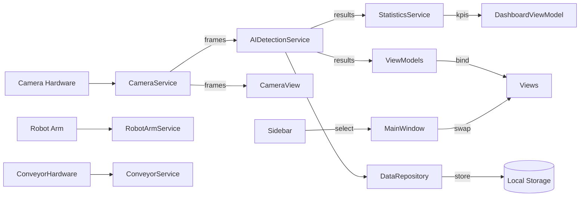
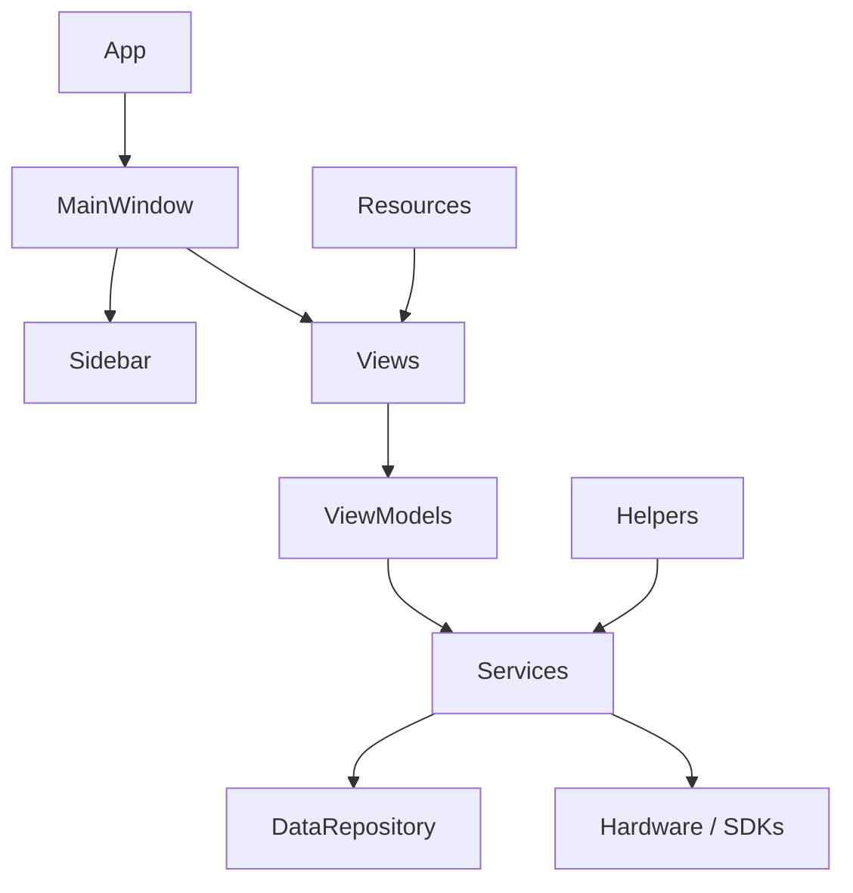

# Tổng quan dự án

- Mục đích ứng dụng

  Hệ thống Kiểm tra Pin — một ứng dụng desktop HMI công nghiệp cho phép hiển thị luồng camera trực tiếp, chạy phát hiện AI trên các khung hình, trình bày các KPI kiểm tra và trạng thái hệ thống, và cung cấp điều khiển cho băng tải và rô-bốt. Giao diện là WPF được thiết kế như một trạm điều hành (SCADA/HMI) để giám sát và điều khiển quy trình kiểm tra.

- Công nghệ sử dụng

  - .NET 8 (WPF)
  - CommunityToolkit.Mvvm cho hỗ trợ MVVM (ObservableObject, ObservableProperty)
  - UI XAML với các UserControl tùy chỉnh
  - Kiến trúc dịch vụ để tích hợp thiết bị (Camera, Robot, Conveyor, AI)
  - Lưu cấu hình và dữ liệu cục bộ

- Mẫu thiết kế

  Dự án sử dụng MVVM (Model-View-ViewModel):
  - Views: UserControl XAML trong thư mục Views/ và Controls/
  - ViewModels: lớp trong ViewModels/ xuất thuộc tính quan sát và lệnh
  - Models: DTO / cấu hình trong Models/
  - Services: logic thiết bị và nghiệp vụ trong Services/

- Kiến trúc tổng thể

  - MainWindow chứa khung ứng dụng: thanh điều hướng trên cùng, Sidebar trái, vùng nội dung chính (MainContent), panel trạng thái phải và thanh điều khiển dưới cùng.
  - Sidebar phát ra routed event (ItemSelected) mà MainWindow nghe để hoán đổi các View ở vùng nội dung chính.
  - Views được ghép từ Controls và liên kết DataContext với ViewModels. Services cung cấp dữ liệu (khung camera, kết quả AI) cho ViewModels/Views.
  - Cấu hình và trợ giúp nằm trong Helpers/ và Services/DataRepository.cs đảm nhiệm lưu/persist.

------------------------------------------------

# Cấu trúc thư mục

Dưới đây là mô tả từng thư mục, trách nhiệm và cách tương tác.

Controls/
- Mục đích: Cung cấp các thành phần UI tái sử dụng cho Views và MainWindow. Đóng gói bố cục và tương tác nhỏ.
- Trách nhiệm: Chứa widget chung (camera preview, sidebar, thẻ KPI/Status, animation, panel dùng chung).
- Một số file tiêu biểu: CameraPanel.xaml(.cs), CameraPreview.xaml(.cs), CameraView.xaml(.cs), ControlPanel.xaml(.cs), ConveyorAnimation.xaml(.cs), DefectHighlight.xaml(.cs), EventLog.xaml(.cs), RobotPanel.xaml(.cs), Sidebar.xaml(.cs), StatisticsCard.xaml(.cs), StatusIndicator.xaml(.cs), SystemStatus.xaml(.cs), TopNavigationBar.xaml(.cs)
- Tương tác với: Views (nhúng), ViewModels (binding), Services (dữ liệu trực tiếp như khung camera). Sidebar được MainWindow sử dụng cho điều hướng.

Views/
- Mục đích: Các màn hình (page) cấp ứng dụng, ghép Controls thành giao diện cho những chức năng chính (Dashboard, Camera, Conveyor, Settings, Robot Arm, Statistics, Event Log).
- Trách nhiệm: Host Controls, thiết lập DataContext (ViewModel), trình bày bố cục màn hình.
- File: Dashboard.xaml (đã được thiết kế lại), CameraView.xaml, ConveyorView.xaml, EventLogView.xaml, RobotArmView.xaml, SettingsView.xaml, StatisticsView.xaml, AIDetectionView.xaml, v.v.
- Tương tác với: ViewModels/* (DataContext), Controls/* (thành phần UI), Services gián tiếp thông qua ViewModels.

ViewModels/
- Mục đích: Chứa trạng thái trình bày, lệnh và trung gian giữa Services và Views.
- Trách nhiệm: Xuất thuộc tính quan sát (Observable) và ICommand cho Views bind; không chứa nghiệp vụ nặng.
- File tiêu biểu: MainViewModel.cs, DashboardViewModel.cs, CameraViewModel.cs, ConveyorViewModel.cs, RobotArmViewModel.cs, SettingsViewModel.cs, AIDetectionViewModel.cs, StatisticsViewModel.cs, EventLogViewModel.cs
- Tương tác với: Services/* để lấy dữ liệu; Views thông qua binding.

Models/
- Mục đích: DTO và cấu trúc dữ liệu (cấu hình, kết quả detection, thống kê).
- Trách nhiệm: Mang dữ liệu typed giữa các lớp.
- File: CameraConfiguration.cs, BatteryInspection.cs, DetectionResult.cs, InspectionStatistics.cs, ModelBase.cs, SidebarItem.cs, SystemEvent.cs, ApplicationSettings.cs
- Tương tác với: Services (sản xuất/tiêu thụ), ViewModels (hiển thị), Helpers/ConfigurationHelper để nạp cấu hình.

Services/
- Mục đích: Dịch vụ ứng dụng cung cấp logic nghiệp vụ và tích hợp thiết bị.
- Trách nhiệm: Truy cập thiết bị (camera, robot, conveyor), chạy AI, lưu trữ dữ liệu, cung cấp state cho ViewModels.
- File tiêu biểu: CameraService.cs, RobotArmService.cs, ConveyorService.cs, AIDetectionService.cs, DataRepository.cs, EventLogService.cs, SettingsService.cs, StatisticsService.cs
- Tương tác với: ViewModels (khách hàng), Models, Helpers (logging/config), phần cứng hoặc SDK vendor.

Helpers/
- Mục đích: Các tiện ích chung.
- Trách nhiệm: Nạp cấu hình, logging, extension methods, đơn giản ServiceProvider/composition.
- File: ConfigurationHelper.cs, LoggerHelper.cs, ExtensionMethods.cs, ServiceProvider.cs, ValidationHelper.cs
- Tương tác với: Startup, Services, ViewModels.

Resources/
- Mục đích: Tài nguyên XAML chung cho styles, colors, typography.
- File: Buttons.xaml, Cards.xaml, Colors.xaml, Converters.xaml, Styles.xaml, Theme.xaml, Typography.xaml

Doc/
- Mục đích: Tài liệu dự án và hướng dẫn.
- File: ARCHITECTURE.md, tài liệu component, v.v.

Assets/
- Mục đích: Tập tin tĩnh.
- File: README.txt

Root files
- Mục đích: Solution/project, App.xaml, AssemblyInfo, và PROJECT_STRUCTURE.md

------------------------------------------------

# Trách nhiệm file (những file quan trọng)

File: App.xaml / App.xaml.cs

Mục đích:
- Entry point của ứng dụng WPF; gộp ResourceDictionaries và khởi tạo toàn cục.

Trách nhiệm:
- Đăng ký ResourceDictionaries toàn cục
- Khởi tạo dịch vụ chung (nếu có trong App.xaml.cs)

Phụ thuộc:
- Resources/*
- Helpers/ServiceProvider

Gọi bởi:
- Hệ điều hành khi chạy ứng dụng

Thay đổi tương lai:
- Tích hợp DI container, logging, xử lý exception toàn cục.

---

File: MainWindow.xaml / MainWindow.xaml.cs

Mục đích:
- Shell chính: chứa TopNavigationBar, Sidebar, MainContent (ContentControl), panel trạng thái phải, và bottom control panel.

Trách nhiệm:
- Lắng nghe Sidebar.ItemSelected để hoán đổi view trung tâm.
- Làm anchor cho điều hướng và chrome UI chung.

Phụ thuộc:
- Controls/Sidebar
- Views/* (Dashboard, CameraView, SettingsView...)

Gọi bởi:
- App.xaml

Thay đổi tương lai:
- Tách logic điều hướng sang NavigationService để MVVM sạch hơn.

---

File: Controls/Sidebar.xaml & Sidebar.xaml.cs

Mục đích:
- Thanh điều hướng bên trái được MainWindow sử dụng.

Trách nhiệm:
- Hiển thị các nút điều hướng và trạng thái được chọn.
- Phát routed ItemSelectedEvent với Tag của nút được chọn.

Phụ thuộc:
- Styles và Typography trong Resources

Gọi bởi:
- MainWindow (đăng ký sự kiện)

Thay đổi tương lai:
- Chuyển sang ICommand/ItemsSource để hỗ trợ MVVM tốt hơn.

---

File: Views/Dashboard.xaml và Views/Dashboard.xaml.cs

Mục đích:
- Màn hình chính: hiển thị camera, KPI, trạng thái robot/conveyor, hiệu năng hệ thống và cảnh báo.

Trách nhiệm:
- Ghép Controls vào bố cục Grid responsive.
- Quản lý responsive (chuyển đổi cột / reparent panels) vào runtime.
- Bind tới DashboardViewModel cho số liệu.

Phụ thuộc:
- Controls/CameraView, Controls/KpiCard (mới), Controls/StatisticsCard (cũ), ViewModels/DashboardViewModel

Gọi bởi:
- MainWindow qua MainContent

Thay đổi tương lai:
- Bind KPI cards trực tiếp tới DashboardViewModel; cân nhắc dùng VisualStateManager thay cho reparent runtime.

---

File: Controls/CameraView.xaml / CameraView.xaml.cs

Mục đích:
- Hiển thị khung camera trực tiếp và overlay trạng thái.

Trách nhiệm:
- Trình bày frame và thông tin như FPS, độ phân giải, thời gian.

Phụ thuộc:
- CameraService và có thể AIDetectionService

Gọi bởi:
- Dashboard, CameraView page

Thay đổi tương lai:
- Tách service calls sang ViewModel để view chỉ trình bày.

---

File: ViewModels/DashboardViewModel.cs

Mục đích:
- Cung cấp KPI và trạng thái hệ thống cho Dashboard.

Trách nhiệm:
- Xuất các thuộc tính observable: GoodCount, ScratchCount, DentCount, OtherCount, TotalCount, TodaysProduction, trends, RobotStatus, RobotTemperature, SystemHealth

Phụ thuộc:
- Nên được cập nhật bởi StatisticsService, EventLogService hoặc AIDetectionService.

Gọi bởi:
- Dashboard view (DataContext)

Thay đổi tương lai:
- Kết nối rõ ràng tới Services để cập nhật tự động; thêm ICommand nếu cần.

---

Files: Services/* (chi tiết)

CameraService.cs
- Mục đích: quản lý kết nối camera và cung cấp frames/status.
- Input: luồng video hoặc stream
- Output: frames, trạng thái
- Dùng bởi: CameraViewModel, AIDetectionService

AIDetectionService.cs
- Mục đích: chạy inference, trả về DetectionResult
- Input: frames
- Output: DetectionResult (label, bbox, confidence)
- Dùng bởi: AIDetectionViewModel, StatisticsService

RobotArmService.cs
- Mục đích: gửi lệnh tới robot, đọc trạng thái
- Protocol: tùy triển khai (TCP/Serial/SDK), chỉnh trong file này

ConveyorService.cs
- Mục đích: điều khiển băng tải, cung cấp hooks cho animation

DataRepository.cs
- Mục đích: persist detection results, statistics, settings (có thể JSON/SQLite tùy hiện thực)

EventLogService.cs
- Mục đích: tạo và truy xuất sự kiện hệ thống

SettingsService.cs
- Mục đích: đọc/ghi ApplicationSettings

StatisticsService.cs
- Mục đích: tính toán KPI tổng hợp

------------------------------------------------

# Luồng dữ liệu

Sơ đồ chính (Mermaid):

Ví dụ luồng cho một khung hình:

1. Camera phát khung hình.
2. CameraService bắt và phát khung.
3. AIDetectionService xử lý khung, tạo DetectionResult.
4. DetectionResult lưu bằng DataRepository và/hoặc gửi tới StatisticsService để cập nhật KPI.
5. DashboardViewModel nhận KPI và cập nhật UI.
6. Dashboard binding phản ánh thay đổi cho người dùng.

------------------------------------------------

# Đồ thị phụ thuộc (Dependency Graph)

Giải thích:

- App khởi tạo MainWindow.
- MainWindow chứa Sidebar và ContentControl host Views (Dashboard, Camera...).
- Views dùng ViewModels; ViewModels gọi Services; Services có thể lưu vào DataRepository hoặc gọi SDK phần cứng.

------------------------------------------------

# Tích hợp thiết bị (chi tiết)

Camera
- File liên quan: Services/CameraService.cs, Models/CameraConfiguration.cs, Controls/CameraView.xaml, Controls/CameraPreview.xaml
- Mục đích: kết nối camera, cung cấp frame và trạng thái
- Giao thức: không cố định trong repo; có thể RTSP/ONVIF hoặc SDK vendor. Thay đổi ở CameraService.
- Khi đổi phần cứng: cập nhật CameraService, mở rộng CameraConfiguration, thêm UI cấu hình trong SettingsView.

Robot
- File: Services/RobotArmService.cs, Controls/RobotPanel.xaml, ViewModels/RobotArmViewModel.cs
- Mục đích: gửi lệnh robot, đọc trạng thái
- Giao thức: vendor-specific (TCP/JSON/Modbus/OPC-UA)

Conveyor
- File: Services/ConveyorService.cs, Controls/ConveyorAnimation.xaml, ViewModels/ConveyorViewModel.cs
- Mục đích: điều khiển băng tải và animation UI

AI
- File: Services/AIDetectionService.cs, Models/DetectionResult.cs, ViewModels/AIDetectionViewModel.cs
- Mục đích: inference trên khung hình, trả về DetectionResult
- Khi đổi model: cập nhật AIDetectionService hoặc thêm adapter để giữ shape DetectionResult ổn định.

Database / Persistence
- File: Services/DataRepository.cs, Services/StatisticsService.cs
- Mục đích: lưu detection, thống kê, settings. Thay đổi DB: sửa DataRepository và điều chỉnh StatisticsService.

Configuration
- File: Models/ApplicationSettings.cs, Helpers/ConfigurationHelper.cs, Services/SettingsService.cs
- Mục đích: định nghĩa và nạp cấu hình

------------------------------------------------

# Điều hướng (Navigation)

Sidebar navigation hoạt động như sau:
- Controls/Sidebar phát RoutedEvent ItemSelectedEvent khi người dùng nhấn nút; Event mang Tag (string).

MainWindow thay đổi trang như thế nào:
- MainWindow lắng nghe sự kiện ItemSelected và trong handler khởi tạo View tương ứng (UserControl) và gán cho MainContent.Content.

Các file điều khiển navigation:
- Controls/Sidebar.xaml(.cs) — giao diện và phát event
- MainWindow.xaml(.cs) — handler và hoán đổi nội dung

Thêm trang mới:

1. Tạo Views/MyNewPage.xaml & MyNewPage.xaml.cs.
2. Tạo ViewModel (ViewModels/MyNewPageViewModel.cs) và set DataContext.
3. Thêm Button vào Controls/Sidebar.xaml với Tag="MyNewPage".
4. Cập nhật MainWindow.xaml.cs OnSidebarItemSelected để trả về new Views.MyNewPage() cho tag "MyNewPage" hoặc cải tiến bằng NavigationService.

Khuyến nghị: Tạo NavigationService để map tag -> factory và giảm coupling trong MainWindow.

------------------------------------------------

# Cấu hình

How settings are loaded
- Helpers/ConfigurationHelper.cs thực hiện đọc cấu hình (có thể từ JSON hoặc môi trường); SettingsService ghi/đọc ApplicationSettings.

Vị trí lưu file cấu hình
- Không thấy file cấu hình cụ thể trong repo; DataRepository hoặc ConfigurationHelper thường quyết định đường dẫn (AppData, file JSON). Kiểm tra SettingsService/DataRepository để biết chi tiết.

Cách thêm setting mới

1. Thêm property vào Models/ApplicationSettings.cs.
2. Update ConfigurationHelper/SettingsService để đọc/ghi property.
3. Expose setting trong Views/SettingsView và bind vào SettingsViewModel.

------------------------------------------------

# Thành phần UI (UserControls)

Các UserControl chính và mô tả ngắn:

- Controls/Sidebar.xaml: thanh điều hướng trái; dùng trong MainWindow; điều khiển bằng routed event.

- Controls/CameraView.xaml & CameraPreview.xaml: hiển thị khung camera; dùng trong Dashboard và Camera page; data từ CameraService.

- Controls/StatisticsCard.xaml: thẻ KPI tái sử dụng; dùng trong Dashboard; dữ liệu từ DashboardViewModel.

- Controls/KpiCard.xaml (mới): thẻ KPI tiêu chuẩn, dùng trong Dashboard; hỗ trợ dependency properties để binding.

- Controls/RobotPanel.xaml: UI điều khiển/trạng thái robot; dùng trong Dashboard và RobotArmView; controlled bởi RobotArmViewModel.

- Controls/ConveyorAnimation.xaml: animation băng tải; dùng trong Dashboard, ConveyorView; controlled bởi ConveyorService.

- Controls/EventLog.xaml: hiển thị event log; dùng trong Dashboard (preview) và EventLogView (full); controlled bởi EventLogViewModel.

------------------------------------------------

# Services (chi tiết)

Danh sách các service & chi tiết ngắn (xem PROJECT_STRUCTURE.md gốc để biết trách nhiệm đầy đủ):
- CameraService, AIDetectionService, RobotArmService, ConveyorService, DataRepository, EventLogService, SettingsService, StatisticsService.

Mỗi service có mục đích, input/output, dependency và ViewModel sử dụng tương ứng.

------------------------------------------------

# ViewModels (chi tiết)

Giải thích các ViewModel chính và nhiệm vụ:
- MainViewModel: giữ trạng thái toàn cục (nếu có).
- DashboardViewModel: cung cấp KPI và trạng thái cho Dashboard (các thuộc tính observable như GoodCount, TotalCount, trends, RobotStatus,...).
- CameraViewModel: quản lý camera (kết nối, FPS, frame hiện tại).
- RobotArmViewModel, ConveyorViewModel: điều khiển thiết bị tương ứng.
- SettingsViewModel: nạp/lưu ApplicationSettings.
- AIDetectionViewModel, StatisticsViewModel, EventLogViewModel: phục vụ các màn hình chuyên biệt.

------------------------------------------------

# Models (chi tiết)

- CameraConfiguration.cs: thông tin kết nối camera (ip, port, id, credentials).
- BatteryInspection.cs: metadata cho mỗi pin được kiểm tra.
- DetectionResult.cs: label, confidence, bbox, frameId, timestamp.
- InspectionStatistics.cs: các trường tổng hợp (counts, pass rate).
- ModelBase.cs: trường chung (Id, CreatedAt).
- SidebarItem.cs: DTO cho mục sidebar (nếu dùng động).
- SystemEvent.cs: severity, text, timestamp.
- ApplicationSettings.cs: cấu hình ứng dụng.

------------------------------------------------

# Resources

- Styles.xaml, Typography.xaml, Colors.xaml, Theme.xaml: phong cách, typography, màu dùng chung.
- Converters.xaml: value converters (BoolToVisibility, DateTime format, v.v.).

Gợi ý: dùng DynamicResource cho màu để hỗ trợ theme runtime.

------------------------------------------------

# Trình tự khởi động (Startup Sequence)

1. Ứng dụng được khởi động.
2. App.xaml xử lý ResourceDictionaries và khởi tạo.
3. MainWindow được tạo và InitializeComponent gọi.
4. MainWindow dựng shell UI (TopNavigationBar, Sidebar, MainContent, Right status, Bottom control panel).
5. Sidebar có thể chọn mặc định (Dashboard) và sự kiện ItemSelected khiến MainWindow đặt Dashboard vào MainContent.
6. Dashboard được tạo; DataContext (DashboardViewModel) được set nếu chưa có; Dashboard khởi tạo responsive layout.
7. Services bắt đầu khi ViewModels/Views yêu cầu (ví dụ CameraService khi mở CameraView).

------------------------------------------------

# Hướng dẫn mở rộng (Extension Guide)

Thêm trang mới:
- Tạo Views/MyPage.xaml & ViewModel, thêm Button vào Sidebar và map tag -> View trong MainWindow hoặc NavigationService.

Thêm camera mới:
- Mở Models/CameraConfiguration, cập nhật CameraService để hỗ trợ protocol mới, expose cấu hình trong Settings.

Thêm robot mới:
- Mở Services/RobotArmService.cs để triển khai protocol mới; cập nhật ViewModel và Controls.

Thêm AI model:
- Cập nhật Services/AIDetectionService.cs để tải model mới; đảm bảo DetectionResult không thay đổi nhiều.

Thêm database mới:
- Thay thế Services/DataRepository.cs bằng implementation mới (SQLite, v.v.) và cập nhật StatisticsService.

Thêm giao thức thiết bị:
- Thêm implementation vào Services/ (ví dụ RobotArmOpcUaService.cs) hoặc mở rộng dịch vụ hiện có với chiến lược protocol.

------------------------------------------------

# Cải tiến tương lai

1. Dùng DI container (Microsoft.Extensions.DependencyInjection) và đăng ký services/interfaces trong App.xaml.cs để quản lý phụ thuộc.
2. Tạo NavigationService và điều hướng theo ViewModel để MainWindow bớt phụ thuộc vào Views cụ thể.
3. Chuyển Sidebar sang MVVM (ItemsSource + SelectedItem bindable).
4. Trung tâm hoá color/spacing tokens trong ResourceDictionary và dùng DynamicResource.
5. Thay emoji bằng icon vector để render nhất quán trên DPI khác nhau.
6. Thêm unit/integration tests cho Services và ViewModels.
7. Thêm virtualization cho danh sách lớn (EventLog).
8. Di chuyển responsive logic sang VisualStateManager hoặc AdaptiveTriggers.
9. Thêm telemetry và logging cấu trúc.

------------------------------------------------

# Các file khả nghi/không dùng (ghi chú)

- Controls/Sidebar.xaml.bak: file backup; có thể không được biên dịch. Kiểm tra trước khi xóa.
- Thư mục Doc/ chứa nhiều markdown hữu ích cho dev; không bị thực thi.

Nếu bạn muốn, tôi có thể tiếp tục:
- Bind các KpiCard tới DashboardViewModel.
- Thêm interfaces cho Services và cấu hình DI.
- Chuyển Sidebar sang MVVM.

Kết thúc PROJECT_STRUCTURE_VI.md
